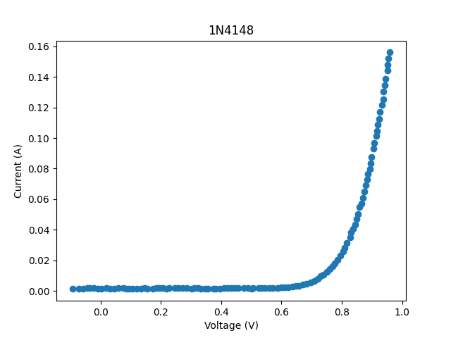
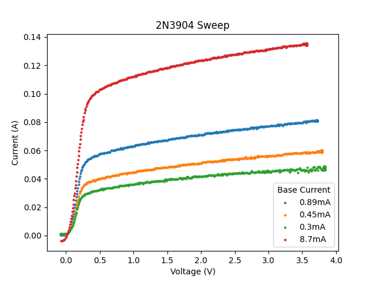

<h2> USB Curve Tracer </h2>
This is my attempt at making a curve tracer.  
Instead of implementing a display, data is piped to an external computer where it is plotted using Python. It also controlled using a command line interface on the external computer. 

<h3> Revision 3 Specs </h3>
<ul>
<li>12V External Power Supply</li>
<li>Maximum Positive Sweep Voltage: 4V</li>
<li>Minimum Negative Sweep Voltage: -3.9V</li>
<li>Full Sweep Time: 15.4s</li>
</ul>

<h3> Limitations </h3>
<ul>
<li>The curve tracer does not use sinusoidal waveforms for measurement; measuring reactive components 
(Capacitors and Inductors) probably will not work. </li>
<li>The curve tracer cannot be driven, so it cannot measure voltage sources.</li>
<li>The curve tracer does not include Kelvin connection functionality, so test lead resistance and 
contact resistance will be included in the measurement. </li>
<li> The curve tracer does not include any programmable gain stages. For this reason, you only get full
current/voltage measurement when using the full current/voltage range.</li>
</ul> 

<h3> Examples </h3>

Below is an example 1N4148 diode sweep and a 2N3904 BJT sweep. Short of curve tracing with a different system and doing a comparison, there is not really a good way to verify if these are correct. However, the general shape of the curves does look right. There is clearly some offset error for the red trace of the 2N3904 sweep. 

