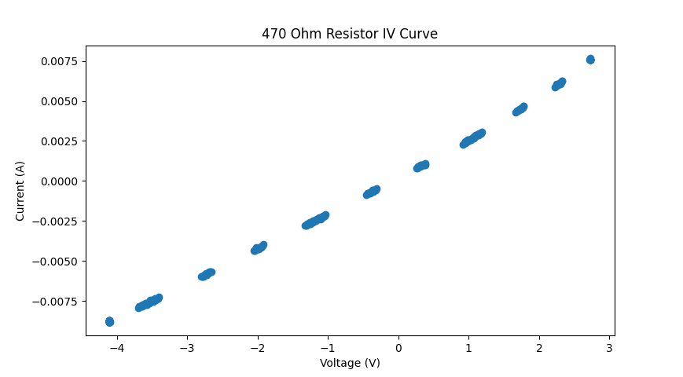

<h2> USB Curve Tracer </h2>
This is my attempt at making a curve tracer. Precision parts are not used so this obviously effects the performance. 
Instead of implementing a display, data is piped to a PC where it is plotted using Python. 

The curve tracer does not use sinusoidal waveforms for measurement; measuring reactive components 
(Capacitors and Inductors) probably will not work. The curve tracer also cannot be driven, so it 
cannot measure voltage sources. 

<h3> Specs </h3>
- 12V External Power Supply

Here are a few preliminary curves.

