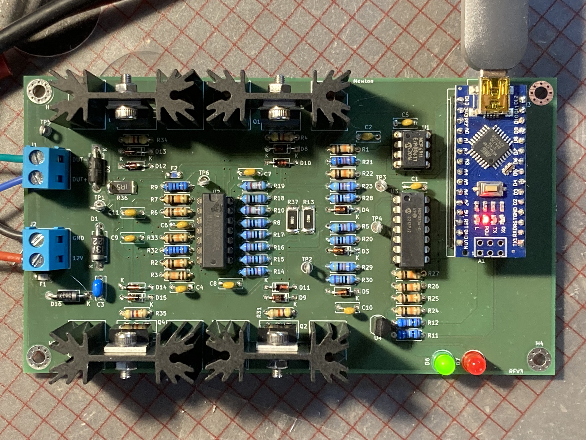
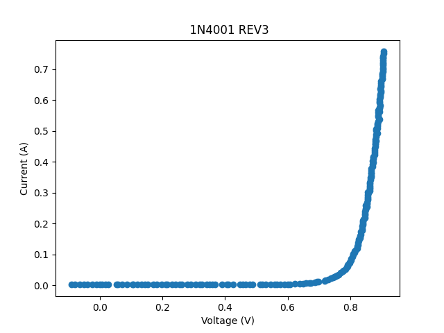

<h2> USB Curve Tracer </h2>
This is my attempt at making a curve tracer.  
Instead of implementing a display, data is piped to an external computer where it is plotted using Python. It also controlled using a command line interface on the external computer. 

<h3> Revision 3 Specs </h3>
<ul>
<li>12V External Power Supply</li>
<li>Maximum Positive Sweep Voltage: 4V</li>
<li>Minimum Negative Sweep Voltage: -3.9V</li>
<li>Full Sweep Time: 15.4ss</li>
</ul>

<h3> Limitations </h3>
<ul>
<li>The curve tracer does not use sinusoidal waveforms for measurement; measuring reactive components 
(Capacitors and Inductors) probably will not work. </li>
<li>The curve tracer cannot be driven, so it cannot measure voltage sources.</li>
<li>The curve tracer does not include Kelvin connection functionality, so test lead resistance and 
contact resistance will be included in the measurement. </li>
</ul> 

<h3> Examples </h3>

Here is a diode curve taken with the revision 3 device. 

Here are a few diode curves taken with the revision 2 device. 

Here is a Darlington Transistor sweep taken with revision 3 of the device. 
I'm not sure if it's right or not. 

